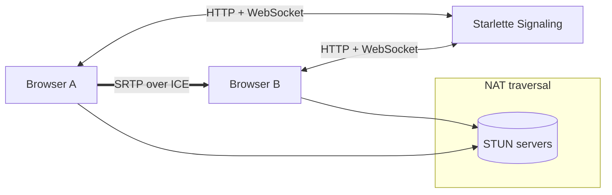

# Yawnfox

Random video chat that pairs two strangers in the browser using WebRTC. Starlette handles signaling. Media flows peer to peer for low latency and low cost.

**Live demo:** <link if you have one>  
**Design document (PDF):** /docs/Yawnfox-SDD.pdf

---

## Table of contents

- [Features](#features)
- [Architecture](#architecture)
- [Tech stack](#tech-stack)
- [Getting started](#getting-started)
- [Configuration](#configuration)
- [Running](#running)
- [Signaling protocol](#signaling-protocol)
- [Limits and known issues](#limits-and-known-issues)
- [Roadmap](#roadmap)
- [License](#license)

---

## Features

- One to one random pairing for audio and video
- Fast call setup using WebRTC with STUN for NAT discovery
- Minimal Starlette backend for HTTP and WebSocket signaling
- Simple browser UI written in JavaScript
- No database by default - ephemeral in memory state

---

## Architecture

